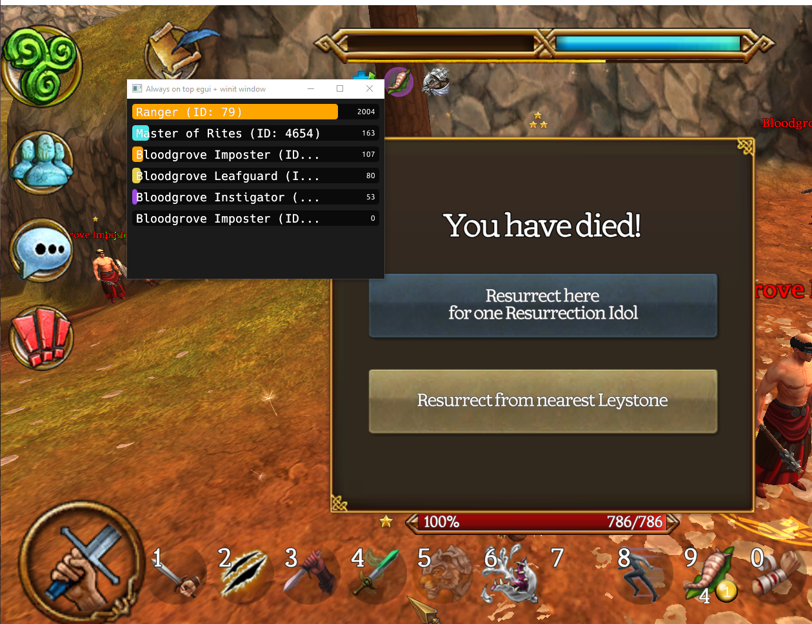

v(1.1)

How It Works:

Cheat Engine attaches to the running Celtic Heroes game process to read game memory in real time

The provided .CT file contains assembly and a Lua script made for Celtic Heroes to read damage data

The assembly script modifies how damage data is accessed

The Lua script runs inside Cheat Engine and collects damage info, then writes it for visualization

The Damage_Meter_Visuals.exe reads this data and shows player and enemy damage in a window
  
  
Set Up:
- Download the Damage_Meter File(should contain a .CT,.bin,and a graphics window executable)

- Open Cheat Engine 7.6

- Attach Cheat Engine to the Celtic Heroes process by clicking the computer icon in the top-left corner, selecting the Celtic Heroes process from the list, then clicking Open

- Load the Celtic Heroes .CT file by clicking File, then Load, navigating to the folder where the .CT file is saved, and opening it

- Run the assembly script in the lower panel of Cheat Engine

- Open the built-in Lua engine inside Cheat Engine by going to Table, then "Show Cheat Table Lua Script"

- Execute the Lua script(Will look like cheat engine froze thats completely normal its proccessing tons of memory)

- Run Damage_Meter_Visuals.exe

If everything went well, you should see player and enemy damage appear in the Damage Meter window live!

This project is a contribution to the celtic heroes community for the years this game has kept me captivated edit it as you see fit-

